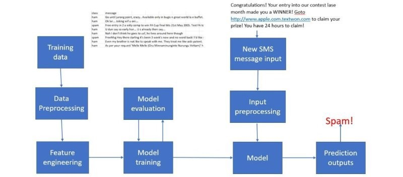
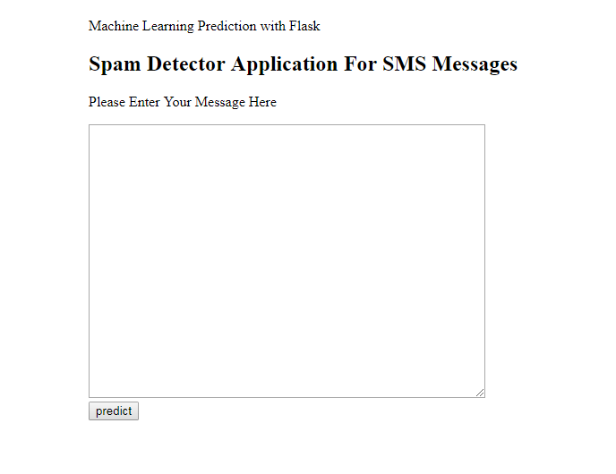

# NLP Model in Python & Deployed in Flask
> The aim of this project to build a machine learning model which can predict if a message/email is spam or not using NLP. 

## Table of contents
* [General info](#general-info)
* [Application Flow Diagram](#Application Flow Diagram)
* [Technologies](#technologies)
* [Setup](#setup)
* [Process](#process)
* [Code Examples](#code-examples)
* [Features](#features)
* [Status](#status)
* [Contact](#contact)

## General info
The workflow of the model looks like this: Train offline -> Make model available as a service -> Predict online. 
Steps involved:
1. A classifier is trained offline with spam and non-spam messages.
2. The trained model is then deployed as a web service to serve users.

## Application Flow Diagram


## Technologies
* Python - version 3.5
* sklearn

## Setup

The dataset used and its metadata can be found [here](https://github.com/siddharthoza/NLP-model-for-Spam-E-mail-classification/tree/master/Data). The python file can be downloaded [here](https://github.com/siddharthoza/NLP-model-for-Spam-E-mail-classification/blob/master/app.py) and can be used to reproduce the result. 


## Process

* I will be using the SMS Spam Collection Dataset which tags 5,574 text messages based on whether they are “spam” or “ham” (not spam).
* Build a classification model using Naive Bayes Classifier to classify which texts are spam.
* I used Naive Bayes Classifier because they are popular statistical technique for e-mail filtering.
* Turned the spam message classifier model into a web application using FLASK


## Code Examples

````
def predict():
	df= pd.read_csv("spam.csv", encoding="latin-1")
	df.drop(['Unnamed: 2', 'Unnamed: 3', 'Unnamed: 4'], axis=1, inplace=True)
	# Features and Labels
	df['label'] = df['v1'].map({'ham': 0, 'spam': 1})
	df['message']=df['v2']
	df.drop(['v1','v2'],axis=1,inplace=True)
	X = df['message']
	y = df['label']
	
	# Extract Feature With CountVectorizer
	cv = CountVectorizer()
	X = cv.fit_transform(X) # Fit the Data
	from sklearn.model_selection import train_test_split
	X_train, X_test, y_train, y_test = train_test_split(X, y, test_size=0.33, random_state=42)
	#Naive Bayes Classifier
	from sklearn.naive_bayes import MultinomialNB

	clf = MultinomialNB()
	clf.fit(X_train,y_train)
	clf.score(X_test,y_test)
	#Alternative Usage of Saved Model
	# joblib.dump(clf, 'NB_spam_model.pkl')
	# NB_spam_model = open('NB_spam_model.pkl','rb')
	# clf = joblib.load(NB_spam_model)

	if request.method == 'POST':
		message = request.form['message']
		data = [message]
		vect = cv.transform(data).toarray()
		my_prediction = clf.predict(vect)
	return render_template('result.html',prediction = my_prediction)
````

## Features
* The model classifier classifies the input message in spam or non-spam with an accuracy of 93% 

The end product looks like this: 



## Status
Project is:  _finished_

## Contact

Created by me

If you loved what you read here and feel like we can collaborate to produce some exciting stuff, or if you
just want to shoot a question, please feel free to connect with me on <a href="siddharth.oza@outlook.com" target="_blank">email</a>, 
<a href="https://www.linkedin.com/in/siddharthoza" target="_blank">LinkedIn</a>

My other projects can be found [here](https://siddharthoza.com).